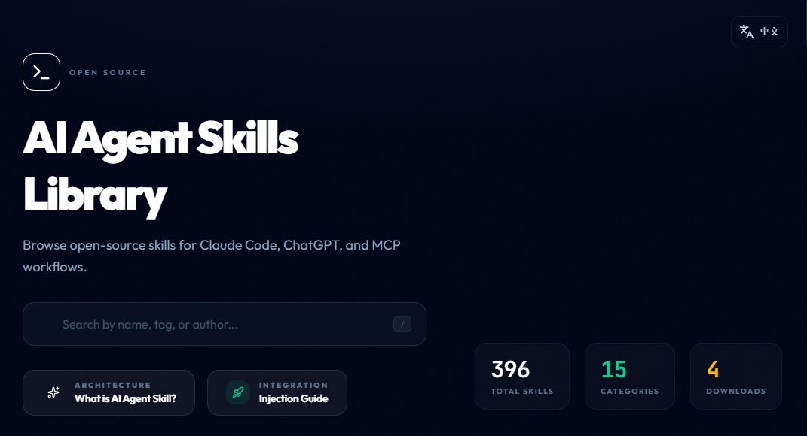

# SKILLS All-in-one

[](https://huangchiyu.com/SKILLS_All-in-one/)
[](LICENSE)
[](https://github.com/eric861129/SKILLS_All-in-one/stargazers)
[](https://github.com/eric861129/SKILLS_All-in-one/issues)
[](CONTRIBUTING.md)

An open-source AI agent skills library for Claude Code, ChatGPT, and MCP-style workflows. Browse, preview, and download curated skills for development, automation, research, writing, and security use cases.

## Live Demo Snapshot

- Live demo: https://huangchiyu.com/SKILLS_All-in-one/
- Supported agents: Claude Code, Claude Desktop, ChatGPT, Gemini CLI
- Skill library: 100+ curated and downloadable skills



## Who Is This For

- Developers who want reusable AI agent skills instead of rewriting prompts and setup docs.
- Teams building MCP-compatible or tool-augmented AI workflows.
- Researchers, writers, and operators who need discoverable skill packages with previewable contents.

## Supported Agents

- Claude Code
- Claude Desktop
- ChatGPT
- Gemini CLI
- Additional agent integrations documented in the site docs

## How It Works

1. Browse the skill library on the website.
2. Open a skill page to inspect files, metadata, and usage intent.
3. Download the skill package and install it into your target agent environment.
4. Follow the setup guide to wire skills into Claude Code, ChatGPT, or other compatible workflows.

## Featured Skill Categories

- Development & Code Tools
- Data & Analysis
- Security & Web Testing
- Writing & Research
- Utility & Automation
- Document Skills

## Featured Use Cases

- Install Claude Code skills for code review, architecture, testing, and automation.
- Reuse ChatGPT-friendly skill packages for research, writing, and workflow acceleration.
- Explore MCP-oriented skills for tool integration, external APIs, and agent orchestration.
- Preview skill contents before download with a deep file inspector.

## Quick Start

```bash
git clone https://github.com/eric861129/SKILLS_All-in-one.git
cd SKILLS_All-in-one
npm install
npm run dev
```

## Technical Stack

- Frontend: React 19, Vite 7, TypeScript, Tailwind CSS 4
- Search and browsing: Fuse.js, React Router
- Packaging and previews: JSZip, React Markdown, syntax highlighting
- Automation: build-time manifest and SEO asset generators

## Repository SEO Checklist

Update these GitHub repository settings manually to match the new site metadata:

- About description: `Open-source AI agent skills library for Claude Code, ChatGPT, and MCP workflows.`
- Website: `https://huangchiyu.com/SKILLS_All-in-one/`
- Topics: `ai-agent`, `claude-code`, `chatgpt`, `mcp`, `prompt-engineering`, `ai-tools`, `skills-library`, `open-source`
- Social preview: use `public/SKILL_ALL_IN_ONE.jpg`

## 中文簡介

**SKILLS All-in-one** 是一個開源的 AI Agent 技能庫，聚焦在 Claude Code、ChatGPT 與 MCP 類型工作流。你可以在網站上搜尋技能、預覽內容、查看檔案結構，再下載到自己的 Agent 環境使用。

### 特色

- 技能可瀏覽、可預覽、可下載，不只是靜態清單。
- 支援開發、自動化、資料分析、寫作研究與安全測試等多種場景。
- 每個技能頁都能直接查看檔案內容與結構。
- 提供安裝與掛載說明，方便接入不同 AI Agent 工作流。

### 快速開始

```bash
git clone https://github.com/eric861129/SKILLS_All-in-one.git
cd SKILLS_All-in-one
npm install
npm run dev
```

## Contributing

See [CONTRIBUTING.md](CONTRIBUTING.md) for contribution flow, new skill submissions, and repository conventions.

## Author

- Website: [huangchiyu.com](https://huangchiyu.com)
- Blog: [ChiYu-Blog](https://huangchiyu.com/ChiYu-Blog/)
- GitHub: [@eric861129](https://github.com/eric861129)

## License

Released under the [MIT License](LICENSE).
